# 🔎 Nexus

A powerful semantic search tool for Freshservice tickets that enables IT help desk teams to quickly find relevant historical incidents and solutions using AI-enhanced natural language queries and ticket-based seeding.

> 🤖 **Picking this up (human or AI agent)?** Read [`STARTER.md`](STARTER.md) first — it covers the current state, the in-progress **Zendesk** migration, the PII + data-quality constraints, and the recommended next step.

## 🚀 Features

- **🤖 AI-Enhanced Search**: AI-powered summarization for better semantic matching
- **Semantic Search**: Find relevant tickets using natural language queries
- **Ticket Seeding**: Start searches from specific ticket IDs to find similar issues
- **Hybrid Search**: Combines free text and ticket-based search capabilities
- **Clean Data**: Automated text cleaning removes signatures and reply chains
- **Rich Metadata**: Full categorization, agent attribution, and ticket details
- **Web UI**: Streamlit-based interface with debug mode and AI toggles
- **📋 Unassigned Tickets Dashboard**: View and manage all unassigned, open tickets with quick actions to open or search for similar tickets
- **✨ On-Demand AI Guidance**: Intelligent recommendations analyzing all notes from similar tickets, suggesting questions, referencing external knowledge bases, and providing context-aware solutions
- **🧠 Model Picker**: Choose the OpenAI model for AI guidance and summaries from the sidebar
- **CLI Interface**: Command-line tool for power users
- **🔧 Error Handling**: Comprehensive diagnostics and troubleshooting tools
- **Smart Startup**: Automated system validation and health checks

## 📊 Current Status

⚙️ **Ready to ingest.** The vector store ships empty. Populate it from your
Freshservice tenant with `python freshservice.py`; statistics will then reflect
your own data. Check live counts any time with `python start_app.py --diagnostics-only`.

## 🏗️ How It Works

```mermaid
flowchart LR
    FS[Freshservice API] -->|ingest closed incidents| ING[freshservice.py]
    ING -->|clean + embed| CH[(ChromaDB&#10;vector store)]
    Q[User query / ticket id] --> APP[Streamlit app.py]
    APP -->|semantic search| CH
    CH -->|candidates| RANK[rerank + bucket]
    RANK --> APP
    APP -->|similar-ticket notes| AI[OpenAI&#10;guidance + summaries]
    AI --> APP
```



1. **Ingest** — `freshservice.py` pulls closed incidents, cleans them, and stores OpenAI embeddings in ChromaDB.
2. **Search** — `app.py` embeds the query/seed ticket, retrieves nearest tickets, then reranks and buckets them by relevance.
3. **Guide** — on demand, the selected OpenAI model analyzes the similar tickets' notes to recommend next steps, category, and assignment group.

## 🛠️ Installation

### Prerequisites
- Python 3.8+
- Freshservice API access
- OpenAI API key

### Smart Setup (Recommended)
```bash
# Clone the repository
git clone <repository-url>
cd FreshService

# Create virtual environment
python -m venv .venv
source .venv/bin/activate  # On Windows: .venv\Scripts\activate

# Install dependencies
pip install -r requirements.txt

# Configure environment variables in api.env
cp api.env.example api.env
# Edit api.env with your API keys

# Smart startup with system validation
python start_app.py
```

### Manual Setup
1. Clone the repository
2. Create virtual environment:
   ```bash
   python -m venv .venv
   source .venv/bin/activate  # On Windows: .venv\Scripts\activate
   ```
3. Install dependencies:
   ```bash
   pip install -r requirements.txt
   ```
4. Configure environment variables in `api.env`:
   ```env
  FRESHSERVICE_DOMAIN=your-subdomain
  FRESHSERVICE_PORTAL_DOMAIN=helpdesk.example.com  # optional custom portal host
   FRESHSERVICE_API_KEY=your-api-key
   OPENAI_API_KEY=your-openai-key
   ```

### First Run
```bash
# Populate database with closed tickets
python freshservice.py

# Start with smart validation
python start_app.py

# Or run diagnostics only
python start_app.py --diagnostics-only
```

## 🔧 Configuration

### Environment Variables (`api.env`)

#### Freshservice Configuration
- `FRESHSERVICE_DOMAIN`: Freshservice API subdomain (e.g., `cuninghamhelpdesk` or `cuninghamhelpdesk.freshservice.com`)
- `FRESHSERVICE_PORTAL_DOMAIN`: Optional custom portal host for ticket links (e.g., `helpdesk.cuningham.com`)
- `FRESHSERVICE_API_KEY`: Your Freshservice API key
- `REQUEST_TIMEOUT_SECONDS`: API request timeout (default: 30)
- `RATE_LIMIT_SLEEP_SECONDS`: Rate limiting delay between API calls (default: 60)
- `FRESHSERVICE_TICKET_URL_TEMPLATE`: Optional override for ticket deep links (default: `https://{domain}/a/tickets/{ticket_id}`)

#### OpenAI Configuration
- `OPENAI_API_KEY`: Your OpenAI API key
- `OPENAI_EMBEDDING_MODEL`: Embedding model (default: `text-embedding-3-small`)
- `OPENAI_GUIDANCE_MODEL`: Model used for AI guidance (default: `gpt-4o-mini`)
- `OPENAI_SUMMARIZER_MODEL`: Model used for ticket summaries & query expansion (defaults to `OPENAI_GUIDANCE_MODEL`)
- `OPENAI_AVAILABLE_MODELS`: Comma-separated models offered in the in-app model picker (uses a sensible default list when unset)

#### ChromaDB Configuration
- `CHROMA_DB_PATH`: Database path (default: `./chroma_db`)
- `CHROMA_COLLECTION_NAME`: Collection name (default: `nexus_tickets`)
- `CHROMA_TELEMETRY_IMPLEMENTATION`: Set to `disabled` to silence PostHog telemetry warnings

#### Search Configuration
- `SEARCH_MAX_DISTANCE`: Default similarity threshold (default: 0.55)
- `SEARCH_MAX_DISPLAY`: Results to display (default: 5)
- `USE_AI_SUMMARY`: Enable AI summary seeding by default (default: 0)
- `MAX_SIMILAR_TICKETS`: Maximum number of similar tickets to analyze for AI guidance (default: 5)
- `LOG_GUIDANCE_PROMPT`: Enable debug logging for AI guidance prompts (set to `1` to enable, default: disabled)

#### Ingest Configuration
- `INGEST_STATUS_CODE`: Ticket status filter (default: 5 = Closed incidents)
- `INGEST_MAX_TOKENS`: Max tokens per ticket (default: 3000)
- `INCLUDE_CONVERSATIONS_IN_EMBED`: Include conversations in embeddings (default: 0)
- `ENABLE_DESCRIPTION_CLEANING`: Clean ticket descriptions (default: 1)
- `INGEST_SINCE_DAYS`: Only ingest tickets updated in the last N days (optional)

## 📖 Usage

### Command Line Interface

#### Free Text Search
```bash
python search_tickets.py "Teams video call problems" --max-distance 0.8
```

#### Ticket Seed Search (AI-Enhanced When Enabled)
```bash
# AI-enhanced search (enable via env)
USE_AI_SUMMARY=1 python search_tickets.py --seed-ticket 4295 --max-distance 0.9

# Raw text search (no AI)
python search_tickets.py --seed-ticket 4295 --no-ai-summary --max-distance 0.9
```

#### Incremental Ingestion
```bash
# Ingest tickets updated in the last 7 days
python freshservice.py --since-days 7
```

#### Search Options
- `--max-distance`: Similarity threshold (0.0 = exact match, higher = more results)
- `--no-clean-seed`: Use raw description instead of cleaned version
- `--no-ai-summary`: Disable AI summarization (use raw text)
- `--open`: Open top result in browser
- `--require-token`: Keep only tickets that mention the same high-signal software terms
- `--same-category-only`: (Seeded searches) restrict to tickets in the same category path

### Web Interface

#### Smart Startup (Recommended)
```bash
python start_app.py --port 8501
```

#### Manual Startup
```bash
streamlit run app.py --server.port 8501
```

Access at: http://localhost:8501

#### Web UI Features
- **🤖 AI-Enhanced Search**: Toggle AI summarization for better results
- **Search Types**: Free text or ticket seeding
- **Distance Threshold**: Adjustable similarity cutoff (default: 0.9)
- **Result Filtering**: Bucket results by similarity (Most Similar, Similar, Related, Loose)
- **Strict Filters**: Optional toggles to require exact software term matches or limit to the seeded ticket's category
- **✨ AI Guidance Button**: Intelligent recommendations based on similar tickets and external sources:
  - Analyzes ALL notes from similar tickets (private and public)
  - Provides actionable next steps tailored to current ticket context
  - Suggests questions to ask when information is missing
  - References external knowledge bases (Microsoft KB, vendor docs) with links when applicable
  - Recognizes solution variance - explains why similar tickets may have different solutions
  - Flags missing context that could lead to incorrect solutions
  - Concise, scannable format optimized for busy technicians
- **Metadata Display**: Full ticket details, agent info, category paths
- **Description Views**: Toggle between cleaned and original descriptions
- **🔧 Debug Mode**: Comprehensive system diagnostics and error information
- **AI Status**: Shows whether search is AI-enhanced or using raw text

### Data Ingestion

To reingest or update the database:
```bash
python freshservice.py
```

This will:
- Fetch closed incidents from Freshservice
- Ignore service requests and any ticket whose status is not closed
- Clean and process ticket descriptions
- Generate embeddings using OpenAI
- Store in ChromaDB for fast retrieval

## 🎯 Search Strategies

### Distance Thresholds
- **0.3**: Very precise matches (fewer results, higher quality)
- **0.55**: Balanced precision/recall (recommended default)
- **0.8**: Broad search (more results, includes loosely related)

### Search Types
1. **Free Text**: Best for discovering general problems
   - "Revit crashes and freezes"
   - "Teams video call issues"
   - "Email not working"

2. **Ticket Seeding**: Best for finding similar specific issues
   - Start with a known ticket ID
   - Find tickets with similar problems
   - Great for escalation and pattern recognition

### Category-Based Search
The system automatically categorizes tickets:
- **Software/Applications**: Revit, Bluebeam, Enscape, etc.
- **Hardware**: Computers, docking stations, peripherals
- **Microsoft Office 365**: Teams, Outlook, SharePoint
- **Network**: Connectivity, VPN, remote access
- **Account and Access**: Login issues, permissions

## 🔍 Advanced Features

### Text Cleaning
- Centralized text processing utilities in `text_cleaning.py`
- Removes email signatures and reply chains
- HTML to text conversion (`html_to_text()`)
- Normalizes whitespace
- Preserves technical content

### Agent Resolution
- Unified agent and group name resolution via `agent_resolver.py`
- Resolves agent IDs to names with intelligent caching (`@lru_cache`)
- Handles group assignments with consistent error handling
- Automatic retry logic with rate limit respect
- Fallback to "Unassigned" for None, "Unknown" for errors

### Metadata Enrichment
- Full category paths (Category → Subcategory → Item)
- Priority and status information
- Requester details
- Resolution timestamps

## 🚨 Troubleshooting

### Smart Troubleshooting Tools

#### System Diagnostics
```bash
python start_app.py --diagnostics-only
```
Runs comprehensive system health checks and validation.

#### Debug Mode
Enable debug mode in the Streamlit sidebar to see detailed error information and system status.

### Common Issues

#### ChromaDB Import Errors
```bash
pip install chromadb==0.4.22
```

#### OpenAI API Errors
- Verify API key is valid and has sufficient credits
- Check rate limiting settings
- Ensure model names are correct
- AI summarization will gracefully fall back to raw text if it fails

#### Freshservice API Errors
- Verify domain and API key
- Check network connectivity
- Review rate limiting settings

#### Empty Search Results
- Try increasing `--max-distance` threshold (default is now 0.9)
- Check if query terms are too specific
- Verify database has been properly ingested
- Enable AI-enhanced search for better results

#### AI Enhancement Issues
- System automatically falls back to raw text if AI fails
- Check OpenAI API key and credits
- Use `--no-ai-summary` flag to disable AI enhancement

### Performance Optimization

#### Code Efficiency Improvements
- **Unified Utilities**: Consolidated HTML parsing and agent/group resolution
- **Intelligent Caching**: Category tree and agent names cached with `@lru_cache`
- **Session Reuse**: HTTP sessions reused in Streamlit (via `@st.cache_resource`)
- **Parallel Processing**: Ticket context fetching uses parallel API calls (max 5 concurrent)
- **Reduced Duplication**: ~250 lines of duplicate code eliminated

#### AI Enhancement Benefits
- **Improved Results**: +11% more comprehensive search results
- **Better Relevance**: AI expands technical terms and focuses on core issues
- **Semantic Matching**: Enhanced bridges between new and historical tickets
- **Fallback Safety**: Graceful degradation to raw text if AI fails

#### Database Size
- Scales with ingested tickets (~25 KB/ticket on disk)
- Search time: <1 second for most queries
- Memory usage: ~200MB during operation
- AI costs: depend on the selected model (≈$0.003 per guidance call with `gpt-4o-mini`)

#### Rate Limiting
- Freshservice: 100 requests/minute (configurable)
- OpenAI: 3,000 requests/minute (tier dependent)

## 🚀 Deployment Notes

- **Current usage**: Developed and run locally via `.venv` + `python start_app.py` or `streamlit run app.py`. Keep `api.env` outside version control and load it before launching.
- **Preparing for work environment**: mirror the local setup on an internal host. Provision a systemd service (or equivalent) that activates the virtualenv, exports environment variables, and runs `python start_app.py --server.address 0.0.0.0` on a reserved port.
- **Secrets management**: replace the local `api.env` with the organisation’s secret store (1Password, Vault, etc.) and inject `FRESHSERVICE_API_KEY`, `OPENAI_API_KEY`, and model overrides at runtime.
- **Telemetry**: set `CHROMA_TELEMETRY_IMPLEMENTATION=disabled` in production to silence noisy PostHog warnings until ChromaDB updates its dependency.
- **Telemetry roadmap**: Monitor ChromaDB release notes (≥0.5.x) for a PostHog compatibility fix and retest the app with telemetry enabled before re-enabling it.
- **Monitoring**: tail `freshservice_debug.log` and Streamlit logs for OpenAI quota errors or ingestion failures. Schedule `python freshservice.py` (or `freshservice.py --since ...`) via cron to keep embeddings current.

## 📁 Project Structure

```
FreshService/
├── app.py                    # Streamlit web interface
├── config.py                 # Configuration and API clients
├── freshservice.py           # Data ingestion script
├── search_tickets.py         # CLI search interface
├── search_intent.py          # Query intent detection
├── search_context.py         # Ticket context gathering (with parallel API calls)
├── ai_summarizer.py          # AI-powered ticket summarization
├── ai_recommendations.py     # AI guidance generation
├── improved_ai_prompt.py     # AI prompt templates
├── agent_resolver.py         # Unified agent/group name resolution
├── text_cleaning.py          # Text preprocessing & HTML conversion
├── debug_utils.py            # System diagnostics and error handling
├── start_app.py              # Smart startup script
├── maintenance/              # Maintenance utilities
│   └── categories.py         # Category export tool
├── tests/                    # Test suite
│   ├── test_search_intent.py
│   ├── test_relevance_filters.py
│   └── test_ai_summarizer.py
├── requirements.txt          # Python dependencies (+ requirements-dev.txt, requirements.lock.txt)
├── api.env.example           # Environment template (copy to api.env)
└── chroma_db/                # ChromaDB storage (git-ignored)
```

## 🤝 Contributing

1. Fork the repository
2. Create a feature branch
3. Make your changes
4. Test thoroughly
5. Submit a pull request

## 📄 License

This project is proprietary software for Cuningham's IT help desk operations.

## 📞 Support

For technical support or questions:
- IT Help Desk Manager
- Internal documentation and runbooks
- System logs in `/Users/Sather/Documents/Python Programs/FreshService/logs/`

---

**Last Updated**: June 2026  
**Version**: 3.0.0 (Nexus)  
**Status**: Active — modern OpenAI SDK + in-app model picker; audit in progress (see `AUDIT_PLAN.md`)
